# 🤖 Smart AI Agent: RAG, Web Search, Weather & LangGraph

A sophisticated AI agent application that intelligently combines private knowledge base retrieval (RAG) with real-time web search and weather information capabilities, giving users complete control over information sources and full transparency into the AI's decision-making process.

## 🎥 Demo Video  

👉 [Watch Demo Video](Video.mp4)  

*(Open the file `Video.mp4` in this repo to view the demo.)*  

---
## 🌟 Overview

This application represents a cutting-edge approach to AI-powered question answering, where the agent dynamically chooses between internal knowledge, web search, and weather services based on query requirements. Built with a modern tech stack and modular architecture, it provides both developers and users with unprecedented insight into AI reasoning processes.

## ✨ Key Features

### 🧠 **Intelligent Hybrid Reasoning**
- **Dynamic Source Selection**: Automatically routes queries to the most appropriate information source
- **RAG Sufficiency Assessment**: Uses LLM to evaluate whether internal knowledge is adequate
- **Weather Detection**: Smart identification of weather-related queries with location extraction
- **Fallback Mechanisms**: Seamlessly transitions between different information sources

### 🎛️ **User Control & Transparency**
- **Web Search Toggle**: Complete user control over external information access
- **Agent Trace Visualization**: Detailed step-by-step breakdown of AI decision-making process
- **Routing Decision Logs**: Clear visibility into why certain information sources were chosen
- **Multi-Tool Coordination**: See how the agent coordinates between different tools and services

### 📚 **Dynamic Knowledge Management**
- **PDF Upload & Processing**: Instant document ingestion with automatic embedding generation
- **Vector Storage Integration**: Seamless integration with Pinecone for efficient similarity search
- **Contextual Retrieval**: Smart chunk retrieval based on semantic similarity
- **Real-time Weather Data**: Current weather information from OpenWeatherMap API

### 🔧 **Enterprise-Ready Architecture**
- **Modular Design**: Clean separation of concerns across frontend, backend, and agent layers
- **Persistent Memory**: Conversation context maintained across multiple interactions
- **Scalable Infrastructure**: Built for production deployment and scaling
- **Tool Extensibility**: Easy integration of new tools and services

## 🏗️ Architecture Overview

```mermaid
graph TB
    A[👤 User Interface<br/>Streamlit] --> B[🔌 API Layer<br/>FastAPI]
    B --> C[🤖 Agent Core<br/>LangGraph]
    C --> D[📊 Knowledge Base<br/>Pinecone + Embeddings]
    C --> E[🌐 External Tools<br/>Groq LLM + Tavily Search]
    C --> F[🌤️ Weather Service<br/>OpenWeatherMap API]
    C --> G[💾 Memory<br/>Conversation State]
```



### Component Breakdown

| Layer | Technology | Purpose |
|-------|------------|---------|
| **Frontend** | Streamlit | Interactive chat interface with controls |
| **API** | FastAPI | RESTful backend with async capabilities |
| **Agent** | LangGraph | Workflow orchestration and decision routing |
| **Knowledge** | Pinecone + HuggingFace | Vector storage and semantic search |
| **LLM** | Groq (Llama 3) | Natural language processing and generation |
| **Search** | Tavily API | Real-time web search capabilities |
| **Weather** | OpenWeatherMap | Current weather information |

## 📁 Project Structure

```
agentBot/
├── frontend/                   # User Interface Layer
│   ├── app.py                 # 🚀 Streamlit application entry point
│   ├── ui_components.py       # 🎨 Chat interface and UI elements
│   ├── backend_api.py         # 🔗 API communication handlers
│   ├── session_manager.py     # 🗃️ State management and persistence
│   └── config.py              # ⚙️ Frontend configuration
│
├── backend/                    # API and Logic Layer
│   ├── main.py                # 🌐 FastAPI application server
│   ├── agent.py               # 🧠 LangGraph agent workflow
│   ├── vectorstore.py         # 📊 RAG and Pinecone operations
│   ├── weather.py             # 🌤️ Weather service integration
│   └── config.py              # 🔐 Environment and API keys
│
├── requirements.txt           # 📦 Python dependencies
├── .env.example              # 🔧 Environment variables template
└── README.md                 # 📖 This documentation
```

## 🛠️ Technology Stack

### Core Technologies
- **Python 3.9+** - Primary development language
- **Streamlit** - Interactive web interface
- **FastAPI** - High-performance API framework
- **LangGraph** - Agent workflow orchestration

### AI & ML Components
- **LangChain** - LLM integration and tooling
- **Groq (Llama 3)** - Fast inference LLM provider
- **HuggingFace Transformers** - Embedding models
- **sentence-transformers/all-MiniLM-L6-v2** - Semantic embeddings

### Data & Storage
- **Pinecone** - Vector database for similarity search
- **PyPDFLoader** - PDF document processing
- **Tavily API** - Web search integration
- **OpenWeatherMap API** - Real-time weather data

## 🚀 Quick Start Guide

### Prerequisites

Ensure you have the following before starting:

- **Python 3.9+** installed on your system
- **API Keys** from the following services:
  - [Groq](https://console.groq.com/) for LLM inference
  - [Pinecone](https://www.pinecone.io/) for vector storage
  - [Tavily](https://tavily.com/) for web search
  - [OpenWeatherMap](https://openweathermap.org/api) for weather data
- **Pinecone Index** configured with:
  - Name: `rag-index`
  - Dimensions: `384`
  - Metric: `cosine`

### Installation Steps

1. **Clone the Repository**
```bash
git clone https://github.com/your-username/agentBot.git
cd agentBot
```

2. **Set Up Virtual Environment**
```bash
# Using uv (recommended)
uv venv
source .venv/bin/activate  # Linux/Mac
# OR
.venv\Scripts\activate     # Windows

# Using pip
python -m venv venv
source venv/bin/activate   # Linux/Mac
# OR
venv\Scripts\activate      # Windows
```

3. **Install Dependencies**
```bash
# Using uv
uv pip install -r requirements.txt

# Using pip
pip install -r requirements.txt
```

4. **Configure Environment Variables**

Create a `.env` file in the project root:
```env
# LLM Configuration
GROQ_API_KEY=your_groq_api_key_here

# Vector Database
PINECONE_API_KEY=your_pinecone_api_key_here
PINECONE_ENVIRONMENT=your_pinecone_environment

# Web Search
TAVILY_API_KEY=your_tavily_api_key_here

# Weather Service
OPENWEATHER_API_KEY=your_openweather_api_key_here

# Application Settings
FASTAPI_BASE_URL=http://localhost:8000
```

### Running the Application

1. **Start the Backend Server**
```bash
cd backend
uvicorn main:app --reload --host 0.0.0.0 --port 8000
```

2. **Launch the Frontend Interface**
```bash
# In a new terminal, from project root
streamlit run frontend/app.py
```

3. **Access the Application**
   - Open your browser to `http://localhost:8501`
   - The backend API will be available at `http://localhost:8000`
   - API documentation at `http://localhost:8000/docs`

## 📖 Usage Guide

### Basic Chat Interaction

1. **Ask Questions**: Type your query in the chat interface
2. **Toggle Web Search**: Use the sidebar toggle to enable/disable web access
3. **View Agent Trace**: Expand the trace section to see decision-making process
4. **Upload Documents**: Use the file uploader to add PDFs to the knowledge base

### Query Types & Routing

The agent intelligently routes different types of queries:

- **Knowledge Base Queries**: "What are the symptoms of diabetes?" → RAG Search
- **Current Events**: "Latest news about AI" → Web Search
- **Weather Queries**: "What's the weather in London?" → Weather Service
- **General Questions**: "What is machine learning?" → RAG → Web (if insufficient)

### Advanced Features

- **Session Management**: Conversations are automatically saved and restored
- **Multi-turn Dialogues**: Context is maintained across multiple questions
- **Source Attribution**: See which sources (RAG vs Web vs Weather) were used for answers
- **Location Detection**: Weather queries automatically extract location information

## 🌤️ Weather Integration

### Supported Weather Queries

The agent recognizes various weather-related questions:
- "What's the weather in [city]?"
- "Tell me the weather"
- "How's the weather in [location]?"
- "Temperature in [city]"
- "Weather forecast for [place]"

### Location Handling
- **Explicit Location**: "Weather in Paris" → Fetches Paris weather
- **Default Location**: "What's the weather?" → Uses Delhi as default
- **Smart Extraction**: Uses regex to extract city names from natural language

### Weather Response Format
```
The weather in London is light rain with 15°C.
```

## 🧪 API Testing

### Document Upload Endpoint

```bash
curl -X POST "http://localhost:8000/upload-document/" \
     -H "accept: application/json" \
     -H "Content-Type: multipart/form-data" \
     -F "file=@your-document.pdf"
```

**Response:**
```json
{
  "message": "PDF 'your-document.pdf' successfully uploaded and indexed.",
  "filename": "your-document.pdf",
  "processed_chunks": 12
}
```

### Chat Endpoint with Weather

```bash
curl -X POST "http://localhost:8000/chat/" \
     -H "accept: application/json" \
     -H "Content-Type: application/json" \
     -d '{
       "session_id": "test-session-001",
       "query": "What is the weather in Tokyo?",
       "enable_web_search": true
     }'
```

**Response:**
```json
{
  "response": "The weather in Tokyo is clear sky with 22°C.",
  "trace_events": [
    {
      "step": 1,
      "node_name": "router",
      "description": "Router decided: 'weather'",
      "event_type": "router_decision"
    },
    {
      "step": 2,
      "node_name": "weather",
      "description": "Weather lookup performed. Information retrieved. Proceeding to answer.",
      "event_type": "weather_action"
    },
    {
      "step": 3,
      "node_name": "answer",
      "description": "Generating final answer using gathered context.",
      "event_type": "answer_generation"
    }
  ]
}
```

## 🔧 Configuration Options

### Environment Variables

| Variable | Description | Default |
|----------|-------------|---------|
| `GROQ_API_KEY` | Groq API key for LLM inference | Required |
| `PINECONE_API_KEY` | Pinecone API key for vector DB | Required |
| `PINECONE_ENVIRONMENT` | Pinecone environment region | Required |
| `TAVILY_API_KEY` | Tavily API key for web search | Required |
| `OPENWEATHER_API_KEY` | OpenWeatherMap API key | Required |
| `FASTAPI_BASE_URL` | Backend API base URL | `http://localhost:8000` |
| `MAX_TOKENS` | Maximum tokens for LLM responses | `1000` |
| `TEMPERATURE` | LLM creativity temperature | `0.1` |

## 🐛 Troubleshooting

### Common Issues

1. **"Module not found" errors**
   - Ensure virtual environment is activated
   - Verify all dependencies are installed: `pip install -r requirements.txt`

2. **API key authentication failures**
   - Check `.env` file exists and contains valid keys
   - Verify API keys have necessary permissions
   - Test weather API key at OpenWeatherMap

3. **Pinecone connection issues**
   - Confirm index name matches configuration (`rag-index`)
   - Verify index dimensions are set to 384
   - Check Pinecone environment region

4. **Weather service errors**
   - Verify OpenWeatherMap API key is valid and active
   - Check if the requested location exists in the weather service
   - Ensure proper network connectivity

5. **Port conflicts**
   - Backend default port: 8000
   - Frontend default port: 8501
   - Use `--port` flag to specify different ports if needed

### Debug Mode

Enable detailed logging by setting environment variables:
```bash
export LOG_LEVEL=DEBUG
export LANGCHAIN_VERBOSE=true
```

## 🚀 Future Roadmap

### Short-term Enhancements
- [ ] **Streaming Responses**: Real-time token-by-token output
- [ ] **Advanced RAG**: Query rewriting and result reranking
- [ ] **Multi-modal Support**: Image and video processing capabilities
- [ ] **Weather Forecasts**: Extended weather predictions beyond current conditions

### Medium-term Features
- [ ] **Tool Integration**: Calculator, calendar, code interpreter
- [ ] **Enhanced UI**: Dark mode, animations, custom themes
- [ ] **Performance Optimization**: Caching and response time improvements
- [ ] **Location Services**: GPS-based location detection for weather

### Long-term Vision
- [ ] **User Authentication**: Multi-user support with profiles
- [ ] **Analytics Dashboard**: Usage metrics and performance insights
- [ ] **Enterprise Integration**: SSO, role-based access control
- [ ] **Multi-language Support**: Internationalization capabilities
- [ ] **Advanced Weather**: Severe weather alerts and historical data

## 🤝 Contributing

We welcome contributions! Please see our contributing guidelines for details on:
- Code style and standards
- Testing requirements
- Pull request process
- Issue reporting

## 🙏 Acknowledgments

- **LangChain** team for the excellent AI orchestration framework
- **Streamlit** community for the intuitive web app framework
- **Groq** for providing fast and efficient LLM inference
- **Pinecone** for scalable vector database solutions
- **OpenWeatherMap** for reliable weather data services


